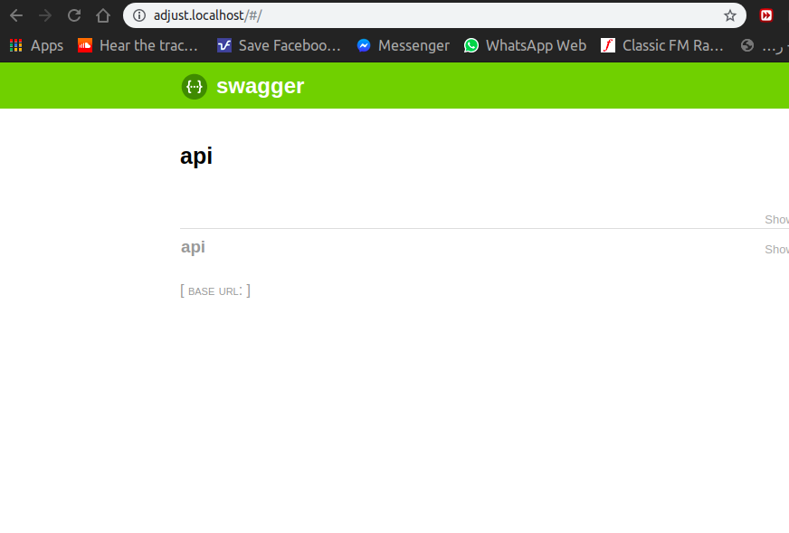

# Adjust Task


# *To run Project*

## First
install Docker on your machine you can follow the steps [here](https://docs.docker.com/install/linux/docker-ce/ubuntu/).

## Second 


cd to folder of project 

- ``` cd AdjustTask```
-  ```docker-compose  up --build``` 

if open project for first time use "*```docker-compose  up --build```*" , if you use it before without change the 
 setting of docker file
 or docker-compose you can just use "*```docker-compose  up```*" 
 - the dataset will upload to database when you run the project when db is empty
 ## after run project
 -  open your browser and type [adjust.localhost](adjust.localhost)
 - the project will open on swagger documentation of API
 
. after open [adjust.localhost](adjust.localhost)
 
 
 
 
 
 
#### Client of this API able to:

1. filter by time range (date_from / date_to is enough), channels, countries, operating systems
2. group by one or more columns: date, channel, country, operating system
3. sort by any column in ascending or descending order
4. see derived metric CPI (cost per install) which is calculated as cpi = spend / installs


# Uses Cases
#### 1.  Show the number of impressions and clicks that occurred before the 1st of June 2017, broken down by channel and country, sorted by clicks in descending order
you can try by postman :
http://adjust.localhost/api/search/?annotate=impressions,clicks&date_to=2017-06-01&groupby=channel,country&ordering=-clicks

  
  

#### 2. Show the number of installs that occurred in May of 2017 on iOS, broken down by date, sorted by date in ascending order.
you can try by postman :
http://adjust.localhost/api/search/?date_from=2017-05-01&date_to=2017-05-31&os=ios&groupby=date&annotate=installs&ordering=date

  
  
  
#### 3. Show revenue, earned on June 1, 2017 in US, broken down by operating system and sorted by revenue in descending order.
you can try by postman :

http://adjust.localhost/api/search/?date_from=2017-06-01&date_to=2017-06-01&country=US&groupby=os&annotate=revenue
&ordering=-revenue


  
  
  
#### 4.Show CPI and spend for Canada (CA) broken down by channel ordered by CPI in descending order

you can try by postman :

http://adjust.localhost/api/search/?country=CA&groupby=channel&CPI=true&annotate=spend&ordering=-CPI


  
  
    